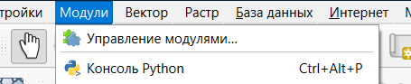
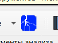
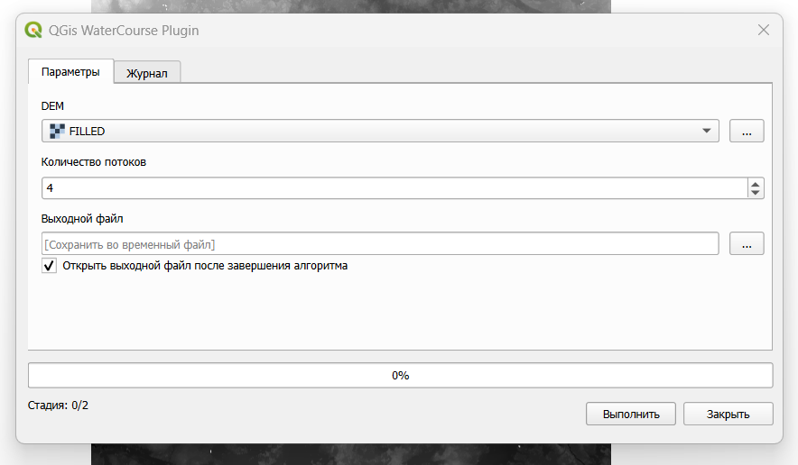
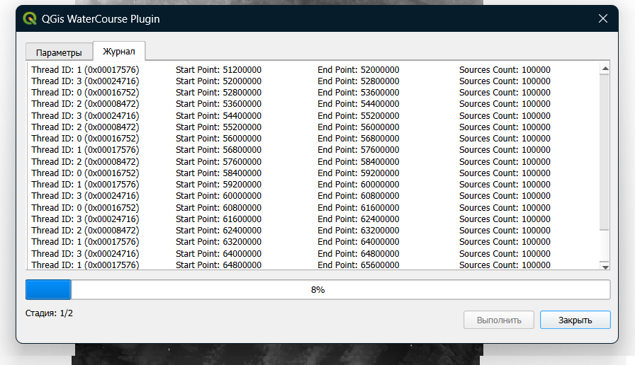
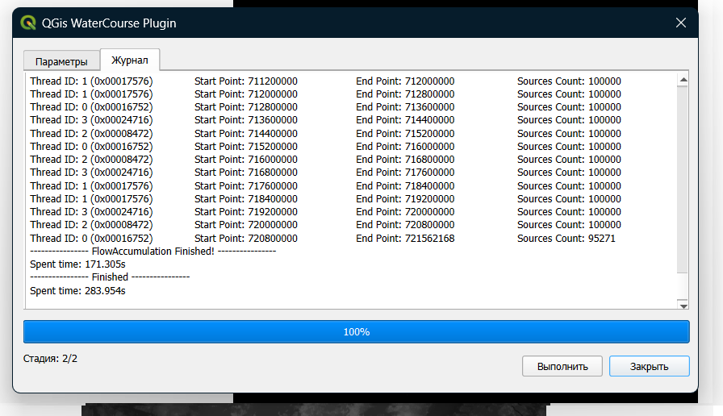
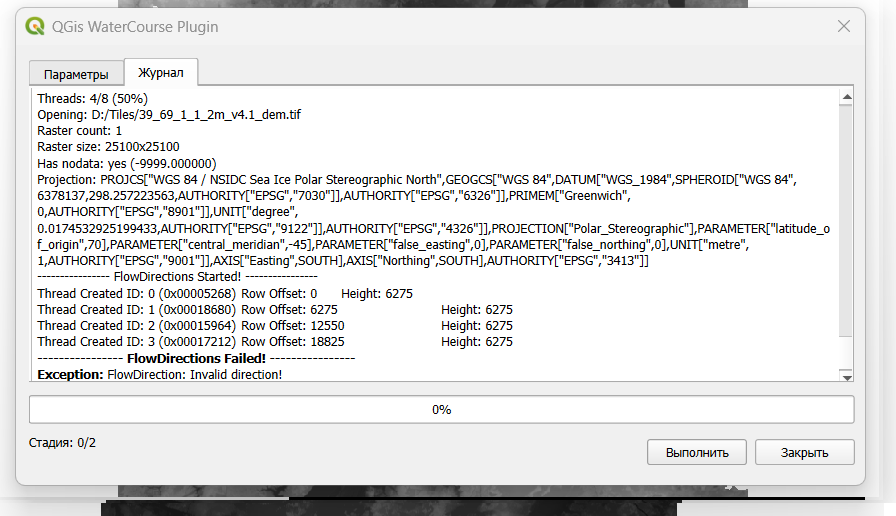

# QGis WaterCourse Plugin

**QGis WaterCourse Plugin** is a plugin that allows you to accumulate matrix watercourse in multi-threaded mode, using the required number of processor cores.

## Installing

1. To start, open the Modules tab.

2. Select "Manage modules...". There, open the "Install from ZIP file" tab, specify the path to the downloaded archive and install the plugin.

## Usage

1. On the toolbar, find the button responsible for the plug-in

2. In the window that opens, specify the parameters you need, such as the DEM being processed, the number of active processor threads, and the output DEM.

3. Wait for the job to finish.

4. If an error occurs, you will receive a notification.

## Conclusion

The plugin is completely open and has the source code, so anyone can make edits and necessary changes.